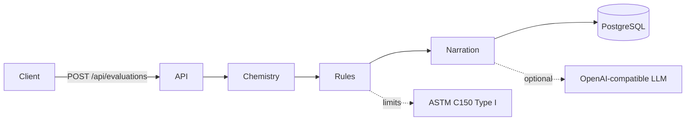

# Cement Quality Evaluation API

*Evaluate ASTM C150 Type I cement oxide readings and return PASS / MARGIN / FAIL verdicts with process recommendations.*

[](https://nodejs.org)
[](https://nestjs.com)
[](https://www.typescriptlang.org)
[](https://www.postgresql.org)

[Overview](#overview) • [Features](#features) • [Getting started](#getting-started) • [API](#api) • [Configuration](#configuration)

API-only NestJS service for cement quality assurance. It takes laboratory oxide readings, derives kiln chemistry (LSF, SR, AR and Bogue phases), scores each parameter against **ASTM C150-22 Type I** limits, and stores a full evaluation report in PostgreSQL.

> [!IMPORTANT]
> This demo supports **ASTM C150 Type I** (`ASTM_TYPE_I`) only. Other cement types are rejected.

## Overview

Given a set of oxide readings, the service runs a fixed evaluation pipeline:

1. **Validate** the request (oxide ranges and a ~95–105% oxide-sum sanity check)
2. **Derive chemistry** — lime saturation factor (LSF), silica ratio (SR), alumina ratio (AR), and Bogue phases (C₃S, C₂S, C₃A, C₄AF)
3. **Rule engine** — compare oxides, ratios, and phases against ASTM C150 Type I limits; each parameter is classified as `PASS`, `MARGIN` (near the limit), or `FAIL`
4. **Narration** — build structured process recommendations (deterministic templates, or optional LLM enrichment)
5. **Persist** the full report in PostgreSQL for later retrieval

The overall verdict is the worst status across all evaluated parameters. Every HTTP response uses a unified envelope:

```json
{ "message": "...", "statusCode": 200, "data": { ... }, "timestamp": "..." }
```



## Features

- **Deterministic rule engine** — oxide, ratio, and Bogue-phase limits loaded from a versioned JSON standard table, including conditional SO₃ ceilings based on C₃A
- **PASS / MARGIN / FAIL** — a configurable margin band (`MARGIN_PCT`, default 5%) flags values that are in-spec but close to a limit
- **Process recommendations** — template-based plant-floor actions by default; optional LLM narration via any OpenAI-compatible chat API, with automatic fallback to templates
- **Report history** — evaluations are stored and can be listed (filter + pagination) or fetched by id
- **OpenAPI** — interactive Swagger UI at `/api/docs`

## Getting started

### Prerequisites

- [Node.js](https://nodejs.org/) 20+
- [Docker](https://docs.docker.com/get-docker/) (for PostgreSQL)

### 1. Start PostgreSQL

```bash
docker compose up -d
```

This starts Postgres 16 on `localhost:5432` with user / password / database `qa` / `qa` / `qa_cement`.

### 2. Configure environment

Create a `.env` file in the project root:

```env
PORT=3000
DATABASE_HOST=localhost
DATABASE_PORT=5432
DATABASE_USER=qa
DATABASE_PASSWORD=qa
DATABASE_NAME=qa_cement
NARRATION_MODE=template
LLM_BASE_URL=https://api.example.com/v1
LLM_API_KEY=placeholder
LLM_MODEL=placeholder
MARGIN_PCT=5
```

- `NARRATION_MODE=template` — recommendations from deterministic impact templates (recommended for local demos)
- `NARRATION_MODE=llm` — optional enrichment via an OpenAI-compatible `/chat/completions` endpoint; falls back to templates on timeout, HTTP error, or invalid output

> [!NOTE]
> Environment variables are validated at startup. `LLM_BASE_URL` must be a valid URL even when narration is set to `template`.

### 3. Install and start

```bash
npm install
npm run start:dev
```

The app listens at:

- API: [http://localhost:3000/api](http://localhost:3000/api)
- Swagger UI: [http://localhost:3000/api/docs](http://localhost:3000/api/docs)

> [!TIP]
> Use Swagger UI to try the evaluation endpoints without writing curl requests. The OpenAPI document describes request bodies, query params, and the wrapped response envelope.

### Other commands

```bash
npm run start        # one-shot start
npm run start:prod   # production (after npm run build)
npm run test         # unit tests (chemistry, rule engine, narration)
npm run test:cov     # coverage
npm run lint         # ESLint
```

## API

Base path: `/api`. Interactive docs: `/api/docs`.

### Create evaluation

`POST /api/evaluations`

This is the main endpoint. A lab (or client) submits one set of oxide readings; the API runs the full quality pipeline, stores a report, and returns the verdict plus recommendations in one response.

**Request body:**

```json
{
  "cementType": "ASTM_TYPE_I",
  "oxides": {
    "CaO": 64.5,
    "SiO2": 21.0,
    "Al2O3": 5.2,
    "Fe2O3": 3.1,
    "MgO": 2.1,
    "SO3": 2.8,
    "LOI": 1.8,
    "IR": 0.5,
    "freeLime": 1.1
  }
}
```

| Field | Required | Notes |
| ----- | -------- | ----- |
| `cementType` | yes | Must be `ASTM_TYPE_I` (the only type this demo supports) |
| `oxides.CaO`, `SiO2`, `Al2O3`, `Fe2O3` | yes | Major oxides, each in `[0, 100]` |
| `oxides.MgO`, `SO3`, `LOI`, `IR`, `freeLime` | yes | Each in `[0, 100]` |

Unknown JSON fields are rejected. The reported oxides (CaO + SiO₂ + Al₂O₃ + Fe₂O₃ + MgO + SO₃ + LOI + IR) must sum to roughly **95–105%**; otherwise the request fails validation before any chemistry is computed. Free lime is evaluated against its own limit but is not part of that sum.

**What happens on each request**

1. **Validate the body** — Nest's `ValidationPipe` checks types, ranges, and the oxide-sum constraint. Failures return `400` in the unified envelope (`message` plus an array of field errors in `data`).

2. **Reject unsupported cement types** — even if the enum grows later, the service currently only accepts `ASTM_TYPE_I`.

3. **Derive chemistry** from the four major oxides:
   - **LSF** (lime saturation factor), **SR** (silica ratio), **AR** (alumina ratio)
   - **Bogue phases** C₃S, C₂S, C₃A, C₄AF
   - **Oxide sum** (same oxides as the 95–105% check, reused as a process parameter)

4. **Run the rule engine** against the ASTM C150-22 Type I table. For every limit (chemical oxides, process ratios, Bogue phases):
   - resolve the limit (SO₃ is **conditional**: ≤ 3.0% if C₃A ≤ 8%, otherwise ≤ 3.5%)
   - classify the measured/computed value as `PASS`, `MARGIN` (in-spec but within `MARGIN_PCT` of the edge), or `FAIL`
   - attach the limit label, group (`chemical` / `process` / `phases`), and a short notes string

5. **Compute the overall verdict** — the worst status across all parameters (`FAIL` > `MARGIN` > `PASS`). A `FAIL` is also logged as a warning.

6. **Generate recommendations** for every non-`PASS` parameter, FAIL items first:
   - **template mode** — deterministic issue / action / impact from plant process rules (`raw_mix`, `kiln`, or `grinding`)
   - **llm mode** — an OpenAI-compatible chat call explains impact and actions **without changing verdicts or numbers**; on timeout, HTTP error, or invalid JSON the same templates are used instead

7. **Persist the report** in PostgreSQL (`evaluation_reports`): original payload, computed ratios and phases, every parameter result, overall verdict, recommendations, and which narration path actually ran.

8. **Return `201`** with the stored report mapped to the response DTO, wrapped as `{ message, statusCode, data, timestamp }`.

**Response `data`:**

| Field | Meaning |
| ----- | ------- |
| `reportId` | UUID of the stored report (use this with `GET /api/evaluations/:id`) |
| `cementType` | Echo of the request (`ASTM_TYPE_I`) |
| `overallVerdict` | `PASS`, `MARGIN`, or `FAIL` |
| `standardApplied` | Standard table version, e.g. `ASTM C150-22 Type I` |
| `computedRatios` | `{ LSF, SR, AR }` |
| `boguePhases` | `{ C3S, C2S, C3A, C4AF }` |
| `parameterResults` | One entry per evaluated limit: `parameter`, `value`, `limit`, `status`, `group`, optional `notes` |
| `recommendations` | Prioritized list: `priority`, `issue`, `action`, `category`, optional `impact` (empty if everything passed) |
| `narrationMode` | `template` or `llm` — the path that produced the recommendations |
| `createdAt` | Report timestamp |

Example `curl`:

```bash
curl -X POST http://localhost:3000/api/evaluations \
  -H 'Content-Type: application/json' \
  -d '{
    "cementType": "ASTM_TYPE_I",
    "oxides": {
      "CaO": 64.5, "SiO2": 21.0, "Al2O3": 5.2, "Fe2O3": 3.1,
      "MgO": 2.1, "SO3": 2.8, "LOI": 1.8, "IR": 0.5, "freeLime": 1.1
    }
  }'
```

### List evaluations

`GET /api/evaluations`

Returns a paginated list of stored reports.

| Query param      | Description                           | Default |
| ---------------- | ------------------------------------- | ------- |
| `overallVerdict` | Filter by `PASS`, `MARGIN`, or `FAIL` | —       |
| `page`           | Page number (≥ 1)                     | `1`     |
| `limit`          | Page size (1–100)                     | `20`    |

Example: `GET /api/evaluations?overallVerdict=FAIL&page=1&limit=20`

### Get evaluation by id

`GET /api/evaluations/:id`

Fetches a single stored report by UUID (`reportId` from create). Returns `404` if the id does not exist.

## How evaluation works

### Chemistry

From the four major oxides the service computes:

| Quantity | Formula |
| -------- | ------- |
| LSF | `CaO / (2.8·SiO₂ + 1.2·Al₂O₃ + 0.65·Fe₂O₃)` |
| SR | `SiO₂ / (Al₂O₃ + Fe₂O₃)` |
| AR | `Al₂O₃ / Fe₂O₃` |
| C₃S, C₂S, C₃A, C₄AF | Standard Bogue equations |

### Limits

Limits live in [`src/standards/data/astm-c150-type-i.json`](src/standards/data/astm-c150-type-i.json) and cover:

- **Chemical** — CaO, SiO₂, Al₂O₃, Fe₂O₃, MgO, SO₃, LOI, IR, free lime
- **Process** — LSF, SR, AR, oxide sum
- **Phases** — C₃S, C₂S, C₃A, C₄AF

SO₃ uses a **conditional** ceiling: ≤ 3.0% when C₃A ≤ 8%, otherwise ≤ 3.5%.

### Margin band

For a max limit `L` and margin `m` (default 5%):

- value > `L` → `FAIL`
- value > `L · (1 − m)` → `MARGIN`
- otherwise → `PASS`

Min and between operators use the same idea at the lower / upper edges of the allowed range.

### Narration

Flagged (`FAIL` then `MARGIN`) parameters are turned into prioritized recommendations in categories `raw_mix`, `kiln`, or `grinding`.

When `NARRATION_MODE=llm`, the service calls `{LLM_BASE_URL}/chat/completions` (8s timeout, JSON schema validation). The LLM is instructed **not** to change verdicts or numbers — only to explain impact and propose actions. Any failure falls back to templates, and the stored `narrationMode` reflects which path was used.

## Configuration

| Variable          | Description |
| ----------------- | ----------- |
| `PORT`            | HTTP port (default in examples: `3000`) |
| `DATABASE_HOST`   | PostgreSQL host |
| `DATABASE_PORT`   | PostgreSQL port |
| `DATABASE_USER`   | PostgreSQL user |
| `DATABASE_PASSWORD` | PostgreSQL password |
| `DATABASE_NAME`   | PostgreSQL database |
| `NARRATION_MODE`  | `template` or `llm` |
| `LLM_BASE_URL`    | OpenAI-compatible API base URL (must be a valid URL) |
| `LLM_API_KEY`     | Bearer token for the LLM provider |
| `LLM_MODEL`       | Model name |
| `MARGIN_PCT`      | Near-limit margin as a percentage (e.g. `5`) |

> [!WARNING]
> Sequelize is configured with `synchronize: true` so the `evaluation_reports` table is created automatically. That is convenient for this demo and is not a production migration strategy.

## Project layout

```
src/
  chemistry/       LSF, SR, AR, Bogue phases
  standards/       ASTM C150 Type I JSON table + resolver
  rule-engine/     PASS / MARGIN / FAIL classification
  narration/       template + LLM strategies
  reports/         persistence
  evaluation/      HTTP API and pipeline orchestration
  database/        Sequelize + evaluation_reports model
  common/          response envelope, interceptor, exception filter
```
