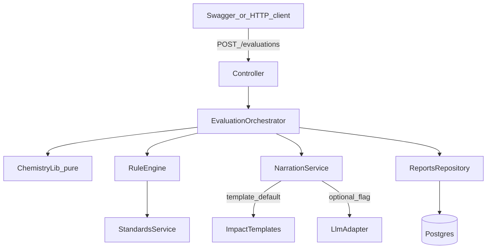

# Cement Quality Evaluation Demo Plan

Build an API-only NestJS demo that evaluates ASTM C150 Type I cement readings via a deterministic rule engine, persists reports in Postgres with Sequelize, and generates recommendations from templates with an optional LLM enrichment flag.

## Build checklist

- [x] Add ConfigModule, docker-compose Postgres, Sequelize module + EvaluationReport model
- [x] Implement pure chemistry lib (LSF/SR/AR/Bogue) with unit tests
- [x] Add ASTM C150 Type I JSON limits + RuleEngine (PASS/MARGIN/FAIL)
- [x] Template narration + optional LLM strategy behind `NARRATION_MODE`
- [x] Evaluation module: DTOs, orchestrator, POST/GET endpoints, Swagger
- [ ] README `.env.example` + example payloads; smoke-test template and llm modes

## Scope (locked)

- **One cement type:** ASTM C150 Type I only
- **Stack:** NestJS 11 (existing scaffold) + PostgreSQL + Sequelize
- **Narration:** deterministic templates always; optional LLM behind `NARRATION_MODE=llm|template` (default `template`)
- **No frontend** — Swagger UI for demos
- **Out of demo scope:** BullMQ alerts, multi-standard support, auth, async streaming

## Architecture (improved vs `cement-opt.md`)

The doc’s module split is sound. For a maintainable NestJS demo, reorganize around **domain boundaries + a clear pipeline**, and treat pure chemistry as a library (not a Nest module).



### Suggested folder layout

```
src/
  main.ts
  app.module.ts
  config/                     # ConfigModule + env validation (Joi/zod)
  database/
    database.module.ts        # SequelizeModule.forRootAsync
    models/
      evaluation-report.model.ts
  common/
    enums/                    # Verdict, CementType, RecommendationCategory
    filters/                  # HttpExceptionFilter
    interceptors/             # LoggingInterceptor (audit-friendly)
  chemistry/                  # PURE lib — no Nest providers
    oxides.ts
    ratios.ts                 # LSF, SR, AR
    bogue.ts
    chemistry.spec.ts         # highest-value unit tests
  standards/
    standards.module.ts
    standards.service.ts      # loads + caches Type I table at boot
    data/astm-c150-type-i.json
  evaluation/                 # feature module (HTTP + orchestration)
    evaluation.module.ts
    evaluation.controller.ts  # POST /api/evaluations, GET /api/evaluations/:id
    evaluation.service.ts     # orchestrates chemistry → rules → narration → persist
    dto/
      create-evaluation.dto.ts
      evaluation-response.dto.ts
  rule-engine/
    rule-engine.module.ts
    rule-engine.service.ts    # PASS/MARGIN/FAIL + overallVerdict
    margin.util.ts            # e.g. within 5% of limit → MARGIN
  narration/
    narration.module.ts
    narration.service.ts      # facade: picks strategy from config
    strategies/
      template-narration.strategy.ts
      llm-narration.strategy.ts
    impact-rules.ts           # static parameter → impact / suggested actions
    schemas/recommendation.schema.ts  # zod for LLM output
  reports/
    reports.module.ts
    reports.service.ts
    reports.repository.ts     # Sequelize access only
```

### Why this is better than the doc sketch

| Doc sketch | Demo architecture |
|---|---|
| Flat `cement-evaluation` + many peer modules | Feature module (`evaluation`) owns HTTP; domain libs stay injectable |
| Chemistry as Nest module | Pure functions — easier to unit test, no DI noise |
| Prisma entity | Sequelize model + repository for Postgres as requested |
| BullMQ alerts in critical path | **Skip for demo**; log FAIL verdicts; add queue later |
| Single AI service | Strategy pattern so template/LLM swap is config-only |

## Data model (Sequelize)

Table `evaluation_reports`:

- `id` UUID PK
- `cementType` string (`ASTM_TYPE_I`)
- `standardVersion` string (e.g. `ASTM C150-22 Type I`)
- `inputPayload` JSONB
- `computedRatios` JSONB
- `boguePhases` JSONB
- `parameterResults` JSONB
- `overallVerdict` enum-like string (`PASS` | `MARGIN` | `FAIL`)
- `recommendations` JSONB nullable
- `narrationMode` string (`template` | `llm`)
- `createdAt` / `updatedAt`

Use `synchronize: true` only in local demo; document that production should use migrations later.

## Standards table (Type I only)

Single file `src/standards/data/astm-c150-type-i.json` with versioned limits for demo parameters, e.g.:

- Chemical: `MgO`, `SO3` (C3A-dependent), `LOI`, `IR`, `freeLime` (plant/demo band)
- Phases: optional advisory bands for `C3S`/`C3A` if useful for narration
- Physical: Blaine, initial/final set, soundness, compressive strength (3/7/28d)

Each limit entry: `{ parameter, op, value | values, unit, notes?, marginPct }`.

Reject any request where `cementType !== ASTM_TYPE_I` with `400`.

## Pipeline (request → response)

1. **Validate** DTO (`class-validator`): oxide ranges, optional Bogue/physical, oxide sum ~95–105% sanity.
2. **Derive** missing ratios + Bogue via pure chemistry helpers.
3. **Classify** each parameter via rule engine + Type I JSON (worst status → `overallVerdict`).
4. **Narrate:** always build structured findings; recommendations from templates; if `NARRATION_MODE=llm`, enrich/replace with schema-validated LLM output, else keep templates. On LLM failure → templates (never fail the request).
5. **Persist** full report; return response matching the contract in `cement-opt.md` §4 (`POST /api/cement/evaluate` → prefer RESTful `POST /api/evaluations`).

## API surface (demo)

- `POST /api/evaluations` — evaluate + persist
- `GET /api/evaluations/:id` — fetch stored report (audit demo)
- `GET /api/evaluations?verdict=FAIL` — optional simple list for swagger demos
- Swagger at `/api/docs`

## Dependencies to add

- `@nestjs/config`, `@nestjs/swagger`, `class-validator`, `class-transformer`
- `sequelize`, `sequelize-typescript`, `@nestjs/sequelize`, `pg`, `pg-hstore`
- `zod` (LLM output validation)
- Optional: `openai` (or fetch-based OpenAI-compatible client) — only used when flag is on

## Config / local run

`.env.example`:

```
DATABASE_HOST=localhost
DATABASE_PORT=5432
DATABASE_USER=qa
DATABASE_PASSWORD=qa
DATABASE_NAME=qa_cement
NARRATION_MODE=template
OPENAI_BASE_URL=https://api.openai.com/v1
OPENAI_API_KEY=
OPENAI_MODEL=gpt-4o-mini
MARGIN_PCT=5
```

For a free demo provider (Groq), use:

```
NARRATION_MODE=llm
OPENAI_BASE_URL=https://api.groq.com/openai/v1
OPENAI_API_KEY=gsk_your_groq_key
OPENAI_MODEL=llama-3.3-70b-versatile
```


Add a `docker-compose.yml` with Postgres only for one-command local demo.

## Testing priorities

1. **Chemistry unit tests** — known worked examples for LSF/SR/AR/Bogue
2. **Rule engine tests** — PASS / MARGIN / FAIL fixtures against Type I JSON
3. **Orchestrator e2e** — one happy path + one FAIL path via `supertest` (prefer Postgres via local compose)

## Implementation order

1. Scaffold config + Sequelize + `EvaluationReport` model + docker-compose
2. Chemistry pure lib + unit tests
3. Standards JSON + `StandardsService` + rule engine
4. Template narration + impact rules
5. `EvaluationService` orchestration + controller + Swagger DTOs
6. Optional LLM strategy + feature flag + graceful fallback
7. Seed/example curl payloads in README; smoke-test both narration modes

## Explicit non-goals for this demo

- Multiple cement types / EN standards
- Frontend UI
- Redis/BullMQ alert workers
- Auth / multi-tenant
- Production migrations / K8s deploy
